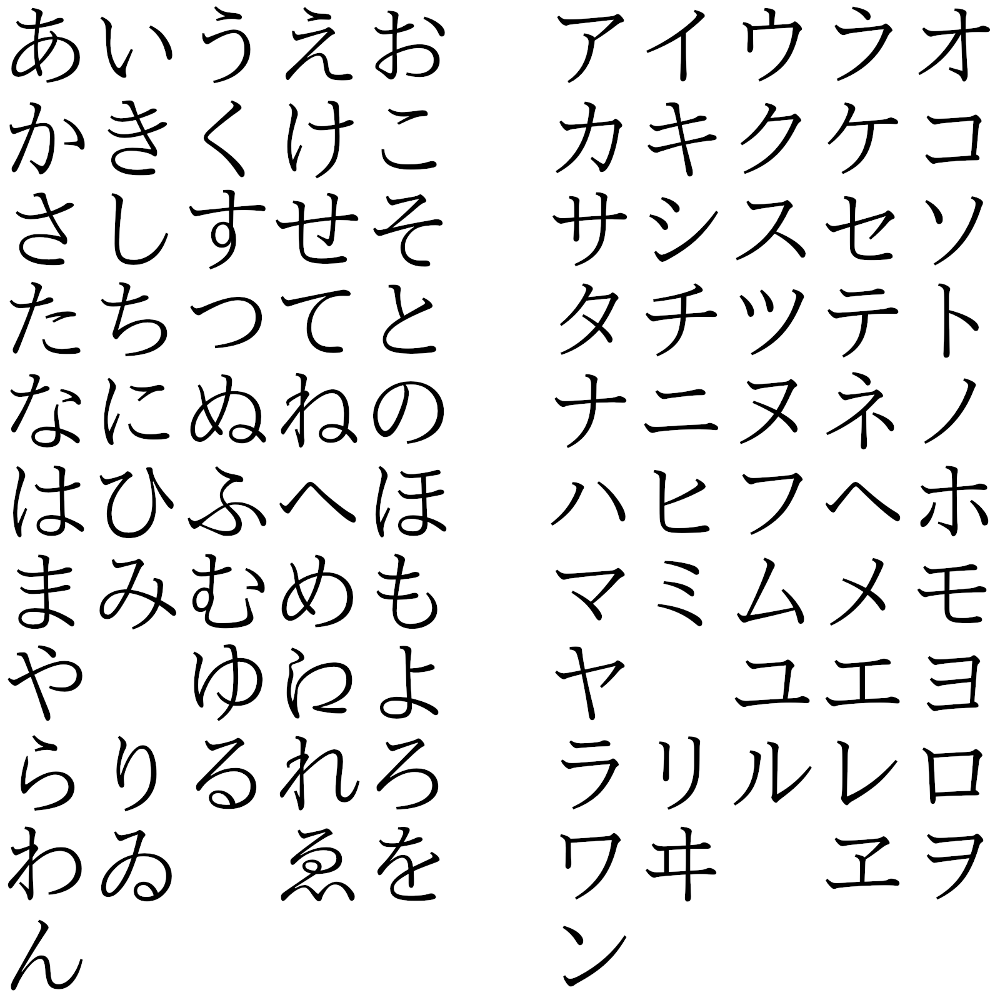

【声明】如果没有例外，那么所有正文部分皆为出口仁老师讲述的信息、或维基百科等权威信息。

YouTubeリンク：https://www.youtube.com/watch?v=wJLu_-bJDAw&list=PLynCeSdpMqxBipKl9EHnBzZFzBnGuB108

 

# １　平仮名・片仮名

**平假名**（日语：平仮名／ひらがな／ヒラガナ hiragana [*****](https://ja.wikipedia.org/wiki/平仮名)，发音：[[çiɾaɡaꜜna, çiɾaɡana(ꜜ)\]](https://zh.wikipedia.org/wiki/Help:日語國際音標)）是[日语](https://zh.wikipedia.org/wiki/日语)中[表音文字](https://zh.wikipedia.org/wiki/表音文字)的一种。

日文中仍然使用大量**汉字**（日语：[漢字／かんじ](https://ja.wikipedia.org/wiki/%E6%BC%A2%E5%AD%97)）。日文中汉字的写法复杂度介于中文繁体字与简体字之间。此外，日本的义务教育规定中，国中毕业前须掌握约 2000 个汉字，以后再学汉字就靠自学了。

**片假名**（日语：片仮名／かたかな／カタカナ katakana [*****](https://ja.wikipedia.org/wiki/片仮名)，发音：[[katakaꜜna, kataꜜkana\]](https://zh.wikipedia.org/wiki/Help:日語國際音標)），是[日语](https://zh.wikipedia.org/wiki/日语)中表音符号（[音节文字](https://zh.wikipedia.org/wiki/音节文字)）的一种，从[汉字](https://zh.wikipedia.org/wiki/汉字)的[楷书](https://zh.wikipedia.org/wiki/楷书)或[部首](https://zh.wikipedia.org/wiki/部首)演化而来。与[平假名](https://zh.wikipedia.org/wiki/平假名)、[万叶假名](https://zh.wikipedia.org/wiki/万叶假名)等合称作[假名](https://zh.wikipedia.org/wiki/日語假名)。如照相机（[カメラ](https://ja.wikipedia.org/wiki/%E3%82%AB%E3%83%A1%E3%83%A9)）。通常而言，外来词汇都用片假名。

# ２　五十音寫法(清音)

# ３　濁音

# ４　長音

# ５　拗音

# ６　促音・語調(アクセント)
