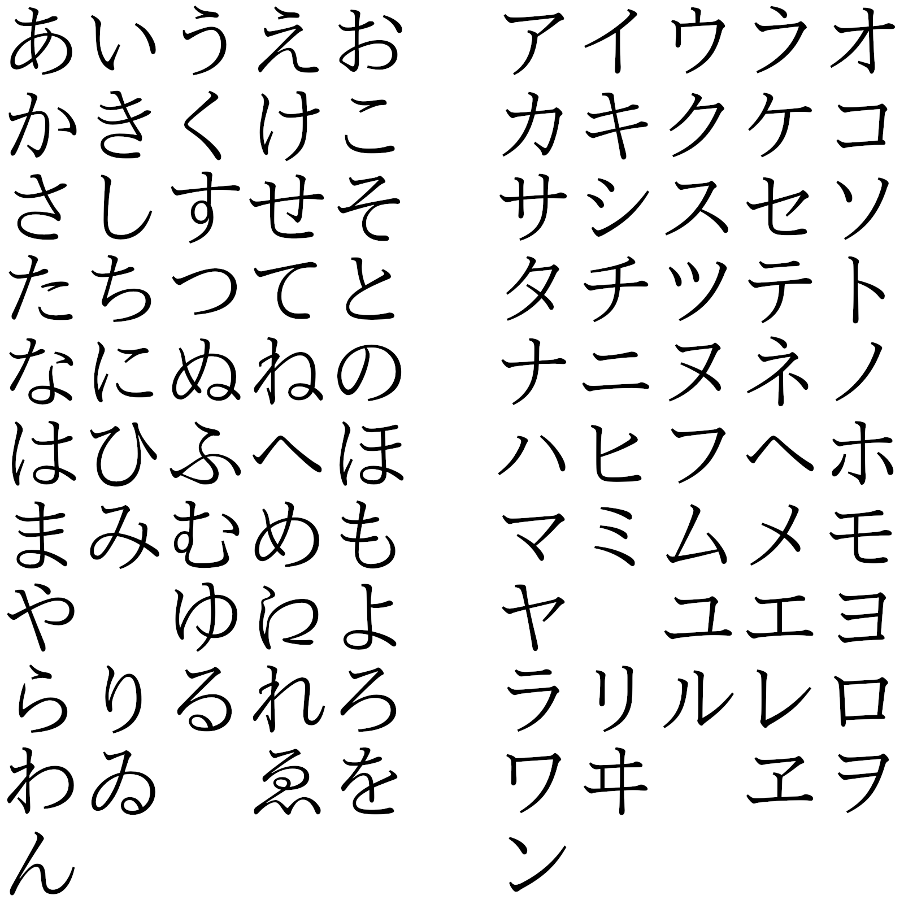

 

# 第 1 課

## 文型（ぶんけい）

1. **わたし**[^1-1]**は**[^1-2]　マイク・ミラーです。（最基本的肯定句）
    1. 田中（たなか）さんは日本人です
2. サントスさんは　学生**じゃありません**[^1-3]。（最基本的否定句）
    1. わたしは　会社員じゃありません。

3. ミラーさんは　会社員ですか。
    1. あなたわ　誰（だれ）ですか。

4. サントスさんも　会社員です。

## 例文（れいぶん）

1. [あなたわ]　マイク・ミラーさんですか。

    ......はい、[わたしは]　マイク・ミラーです。

2. ミラーさんは　学生ですか。

    ……**いいえ**[^1-4]、[わたしは]　学生じゃ　ありません。

3. ワンさんは　銀行員（ぎんこういん）ですか。

    ......いいえ、[ワンさんは]　銀行員じゃ　ありません。

    医者です。

4. あの　方（かた）は　どなたですか。

    ......ワット（Watt）さんです。　さくら大学（だいがく）の　先生です。

5. グプタさんは　会社員ですか。

    ......はい、会社員（かいしゃいん）です。

    カリナさんも　会社員ですか。

    ......いいえ。　[カリナさんは]　学生です。

6. テレサちゃんは　何歳（なんさい）ですか。

    ……９歳です。

## 会話（かいわ）

### 初（はじ）めまして

佐藤（さとう）：おはよう　ございます。

山田（やまだ）：おはよう　ございます。佐藤さん、こちらは　マイク・ミラーさんです。

ミラー：初めまして。マイク・ミラーです。アメリカから　来ました。どうぞ　よろしく。

佐藤：佐藤けい子です。どうぞ　よろしく。

## 単語（たんご）

|                        |      |      |
| ---------------------- | ---- | ---- |
| わたし（私）           |      |      |
| ～さん                 |      |      |
| がくせい（学生）       |      |      |
| かいしゃいん（会社員） |      |      |
| あなた（貴方）         |      |      |
| はい                   |      |      |
| いいえ                 |      |      |
| ぎんこういん（銀行員） |      |      |
| いしゃ（医者）         |      |      |
| あのかた（あの方）     |      |      |
|                        |      |      |
|                        |      |      |
|                        |      |      |
|                        |      |      |
|                        |      |      |
|                        |      |      |
|                        |      |      |
|                        |      |      |
|                        |      |      |
|                        |      |      |
|                        |      |      |
|                        |      |      |
|                        |      |      |
|                        |      |      |
|                        |      |      |
|                        |      |      |
|                        |      |      |
|                        |      |      |
|                        |      |      |

> [^1-1]:わたし＝私
> [^1-2]:「は」在这里是助词，表示这句话的主题的位置。注意，在日语中，虽说「は」在五十音图对应 ha，通常而言也确实读作 ha，但是如果当助词讲的话，是念 wa 的，音同「わ」。
>
> [^1-3]:「じゃありません」是否定句固定用法。其中，「じゃ」也可以用「では」，前者是由后者演变而来，正是因为前者更顺嘴一些，而最终得到广泛使用与承认。根据秋山燿平的节目『[日本人為你講解為什麼「〜ではありません」要避免使用](https://www.youtube.com/watch?v=6zGmMZaW_00)』来看，真的在日本生活过的人，会发现这种表达方式真的很少见，秋山君认为是因为语气过重，给对方一种很强的否定感、距离感，甚至让对方会觉得自己受到了嘲讽。如果总是用这种表达方式，很可能周围人都不愿意和你说话了。正确的做法是，在想要明确地表示否定、比如与客户对接、纠正误会的时候，就不应该含糊其辞了，可以使用「〜ではありません」。但是如果与朋友交谈时候需要明确否定，最好还是不要用这个表达方式。秋山君比较推荐「〜ではないです」，语气不强，而且不会给人疏远的感觉。如果是比较轻松随意的场景，则可以考虑「〜じゃないです」（除了正式场合，这种是最常用的）、「〜じゃない」。第 1 课的最后，出口老师指出，「～です」、「～じゃありません」属于是「丁寧体（ていねいたい）」，适用于初次见面、商务场合等；而「～だ」「～じゃない」属于是「普通体（ふつうたい）」，适用于朋友、熟人、家人之间。
> [^1-4]:同 1-3，秋山君认为「いいえ」这个表达方式也是不够委婉，给人一种过于冷淡、强烈的感觉，听者甚至会觉得自己受到暗讽，听者听到这句话可能会觉得你只是为了否决，而不打算解释原因。推荐替代方案为「ごめん」「申し訳ありません」，如果说没有给对方带来不便，毋须道歉的话，那就可以用「いえ」（适用于商务场合）、「いや」（类似于朋友聊天较随意的场合）。
>
> 
>

# 第 2 課

