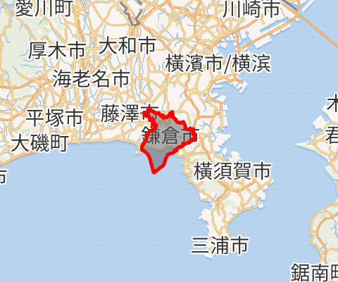
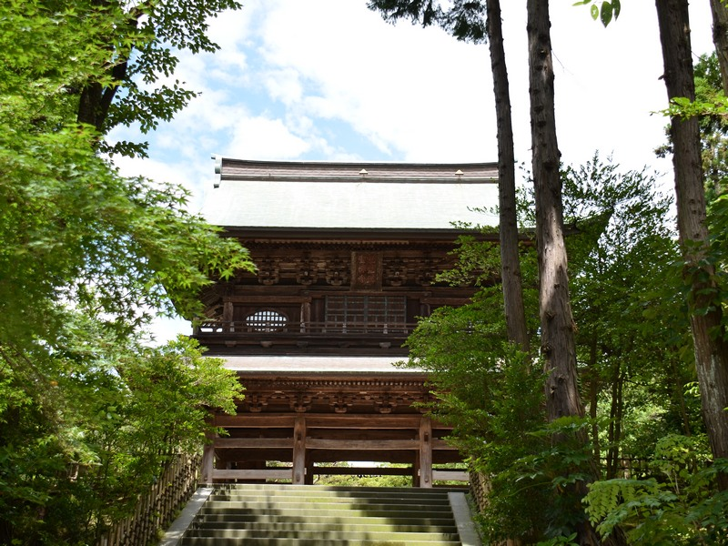

| 原书名   | [千羽鶴 / せんばづる *senbazuru*](https://ja.wikipedia.org/wiki/%E5%8D%83%E7%BE%BD%E9%B6%B4_(%E5%B0%8F%E8%AA%AC)) |
| -------- | ------------------------------------------------------------ |
| 其它译名 | [中] [千羽鹤](https://zh.wikipedia.org/wiki/%E5%8D%83%E7%BE%BD%E9%B6%B4_(%E5%B0%8F%E8%AA%AA)) / [英] *[Thousand Cranes](https://en.wikipedia.org/wiki/Thousand_Cranes)* |
| 作者     | [日] [川端康成](https://ja.wikipedia.org/wiki/%E5%B7%9D%E7%AB%AF%E5%BA%B7%E6%88%90) |
| 类型     | 小说                                                         |
| 发表时间 | 1949 年 — 1952 年                                            |
| 阅读时间 | 第一次：约 2017 — 2018 年                                    |
|          | 第二次：2023 年 10 月下旬                                    |

# 千羽鹤

## 一

三谷菊治收到栗本千鹤子（又译栗本智佳子、栗本近子）的茶会邀请，勾起对千鹤子、母亲以及父亲三人之间的过往的回忆。

### * 名词解析

- [镰仓市](https://zh.wikipedia.org/wiki/%E9%95%B0%E4%BB%93%E5%B8%82)（[鎌倉市／かまくらし *Kamakura shi*](https://ja.wikipedia.org/wiki/%E9%8E%8C%E5%80%89%E5%B8%82)）

    

    位于[日本](https://zh.wikipedia.org/wiki/日本)[神奈川县](https://zh.wikipedia.org/wiki/神奈川县)[三浦半岛](https://zh.wikipedia.org/wiki/三浦半島)西面，是[人口](https://zh.wikipedia.org/wiki/人口)约为 17.3 万人的小型城市。

- 圆觉寺

    

- 茶会

- 茶道

## 二

茶会中千鹤子对菊治一顿寒暄，并向他引荐了自己的女徒弟稻村雪子，同时又遇到了不请自来的太田夫人并初识了其千金文子。

## 三

茶会上的种种器具无处不在勾起菊治父亲与千鹤子、太田夫人的感情瓜葛。茶会结束后菊治闷闷不乐，离开茶会后遇到了等候自己的太田夫人，二人在交谈中竟相互产生了莫名的感觉。

## 四

很快地，菊治与太田夫人二人双双将菊治带入进了菊治的父亲，尽管太田夫人长菊治近二十岁，二人发生了关系。过程中菊治透漏千鹤子邀请茶会是给自己引荐雪子，太田夫人得知后懊悔不已，忍不住痛哭。

## 五

半月后，文子突然登门拜访三谷家，仍然是低着头、眼里噙着泪、拼命地请求菊治能原谅自己的母亲。随后匆匆离去。

# 林中夕阳

# 志野瓷

# 母亲的口红

# 双重星
