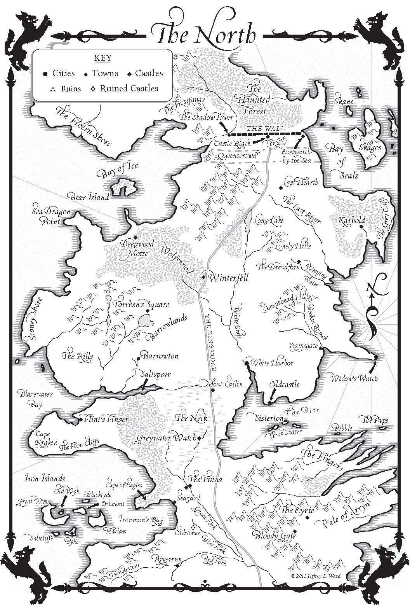
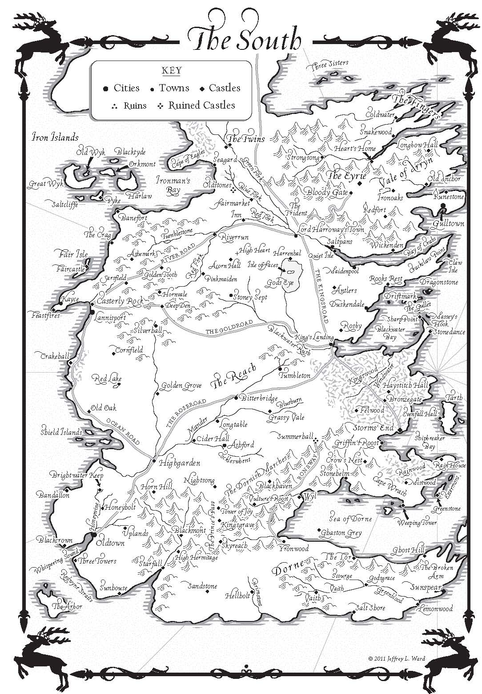

| 原书名   | *A Game of Thrones*                                          |
| -------- | ------------------------------------------------------------ |
| 其它译名 | 【中】[权力的游戏](https://zh.wikipedia.org/wiki/%E6%9D%83%E5%8A%9B%E7%9A%84%E6%B8%B8%E6%88%8F_(%E5%B0%8F%E8%AF%B4))／【日本語】[七王国の玉座](https://ja.wikipedia.org/wiki/%E4%B8%83%E7%8E%8B%E5%9B%BD%E3%81%AE%E7%8E%89%E5%BA%A7)／【한국어】[왕좌의 게임](https://ko.wikipedia.org/wiki/%EC%99%95%EC%A2%8C%EC%9D%98_%EA%B2%8C%EC%9E%84)／【Français】*[A Game of Thrones](https://fr.wikipedia.org/wiki/A_Game_of_Thrones)*／【Deutsch】[*A Game of Thrones*](https://de.wikipedia.org/wiki/A_Game_of_Thrones)／【Español】[*Juego de tronos*](https://es.wikipedia.org/wiki/Juego_de_tronos)／【Русский】[Игра престолов](https://ru.wikipedia.org/wiki/%D0%98%D0%B3%D1%80%D0%B0_%D0%BF%D1%80%D0%B5%D1%81%D1%82%D0%BE%D0%BB%D0%BE%D0%B2_(%D1%80%D0%BE%D0%BC%D0%B0%D0%BD))／【Italiano】[*Il gioco del trono*](https://it.wikipedia.org/wiki/Il_gioco_del_trono) |
| 作者     | 【美】[George R. R. Martin](https://georgerrmartin.com/)     |
| 类型     | 长篇小说／史诗／奇幻／中世纪／政治悬疑                       |
| 发表时间 |                                                              |
| 阅读时间 | 第一次：2024 年 11 月 ~                                      |
|          |                                                              |

this one is for Melinda

# PROLOGUE

“We should start back,” Gared urged as the woods began to grow dark around them. “The **wildlings**[^0-1] are dead.” 

“Do the dead frighten you?” **Ser**[^0-2] Waymar Royce asked with just the **hint**[^0-3] of a smile.

Gared did not rise to the **bait**[^0-4]. He was an old man, past fifty, and he had seen the **lordlings**[^0-5] come and go. “Dead is dead,” he said. “We have no business with the dead.”

“Are they dead?” Royce asked softly. “What proof have we?”

“Will saw them,” Gared said. “If he says they are dead, that’s proof enough for me.”

Will had known they would drag him into the **quarrel**[^0-6] sooner or later. He wished it had been later rather than sooner. “My mother told me that dead men sing no songs,” he put in.

“My **wet nurse**[^0-7] said the same thing, Will,” Royce replied. “Never believe anything you hear at a woman’s **tit**[^0-8]. There are things to be learned even from the dead.” His voice echoed, too loud in the **twilit**[^0-9] forest.

“We have a long ride before us,” Gared pointed out. “Eight days, maybe nine. And night is falling.”

Ser Waymar Royce glanced at the sky with disinterest. “It does that every day about this time. Are you **unmanned**[^0-10] by the dark, Gared?”

Will could see the tightness around Gared’s mouth, the barely suppressed anger in his eyes under the **thick**[^0-11] black **hood**[^0-12] of his cloak. Gared had spent forty years in the **Night’s Watch**[^0-13], **man and boy**[^0-14], and he was not **accustomed**[^0-15] to being **made light of**[^0-16]. Yet it was more than that. Under the wounded **pride**[^0-17], Will could sense something else in the older man. You could taste it; a nervous **tension**[^0-18] that came **perilous**[^0-19] close to fear.

Will shared his unease. He had been four years on the Wall. The first time he had been sent beyond, all the old stories had come rushing back, and his **bowels had turned to water**[^0-20]. He had laughed about it afterward. He was a veteran of a hundred **rangings**[^0-21] by now, and the endless dark wilderness that the **southron**[^0-22] called the **haunted forest**[^0-23] had no more terrors for him.

Until tonight. Something was different tonight. There was an edge to this darkness that made his **hackles**[^0-24] rise. Nine days they had been riding, north and northwest and then north again, farther and farther from the Wall, hard on the track of a band of wildling **raiders**[^0-25]. Each day had been worse than the day that had come before it. Today was the worst of all. A cold wind was blowing out of the north, and it made the trees **rustle**[^0-26] like living things. All day, Will had felt as though something were watching him, something cold and **implacable**[^0-27] that loved him not. Gared had felt it too. Will wanted nothing so much as to ride **hellbent**[^0-28] for the safety of the Wall, but that was not a feeling to share with your commander.

==Especially not a commander like this one.==

Ser Waymar Royce was the youngest son of an ancient house with too many **heirs**[^0-29]. He was a handsome youth of eighteen, grey-eyed and graceful and slender as a knife. Mounted on his huge black **destrier**[^0-30], the knight **towered**[^0-31] above Will and Gared on their smaller **garrons**[^0-32]. He wore black leather boots, black woolen pants, black **moleskin**[^0-33] gloves, and a fine **supple**[^0-34] coat of **gleaming**[^0-35] black **ringmail**[^0-36] over layers of black wool and **boiled leather**[^0-37]. Ser Waymar had been a **Sworn Brother**[^0-38] of the Night’s Watch for less than half a year, but no one could say he had not prepared for his **vocation**[^0-39]. At least insofar as his **wardrobe**[^0-40] was concerned.

His cloak was his **crowning**[^0-41] glory; **sable**[^0-42], thick and black and **soft as sin**[^0-43]. “Bet he killed them all himself, he did,” Gared told the barracks over wine, “twisted their little heads off, our **mighty**[^0-44] warrior.” They had all shared the laugh.

It is hard to take orders from a man you laughed at in your cups, Will **reflected**[^0-45] as he sat **shivering**[^0-46] **atop**[^0-47] his garron. Gared must have felt the same.

“**Mormont**[^0-48] said as we should track them, and we did,” Gared said. “They’re dead. They shan’t trouble us no more. There’s hard riding before us. I don’t like this weather. If it snows, we could be a **fortnight**[^0-49] getting back, and snow’s the best we can hope for. Ever seen an ice storm, my lord?”

The lordling seemed not to hear him. He **studied**[^0-50] the deepening twilight in that half-bored, half-distracted way he had. Will had ridden with the knight long enough to understand that it was best not to interrupt him when he looked like that. “Tell me again what you saw, Will. All the details. Leave nothing out.”

Will had been a hunter before he joined the Night’s Watch. Well, a **poacher**[^0-51] in truth. **Mallister**[^0-52] **freeriders**[^0-53] had caught him **red-handed**[^0-54] in the Mallisters’ own woods, skinning one of the Mallisters’ own **bucks**[^0-55], and it had been a choice of putting on the black or losing a hand. No one could move through the woods as silent as Will, and it had not taken the black brothers long to discover his talent.

“The camp is two miles farther on, over that **ridge**[^0-56], hard beside a stream,” Will said. “I got close as I dared. There’s eight of them, men and women both. No children I could see. They put up a **lean-to**[^0-57] against the rock. The snow’s pretty well covered it now, but I could still make it out. No fire burning, but the firepit was still **plain as day**[^0-58]. No one moving. I watched a long time. No living man ever lay so still.”

“Did you see any blood?”

“Well, no,” Will admitted.

“Did you see any weapons?”

“Some swords, a few bows. One man had an axe. Heavy-looking, doublebladed, **a cruel piece of iron**[^0-59]. It was on the ground beside him, right by his hand.”

“Did you make note of the position of the bodies?”

Will **shrugged**[^0-60]. “A couple are sitting up against the rock. Most of them on the ground. Fallen, like.”

“Or sleeping,” Royce suggested.

“Fallen,” Will insisted. “There’s one woman up an ironwood, half-hid in the branches. A far-eyes.” He smiled thinly. “I took care she never saw me. When I got closer, I saw that she wasn’t moving neither.” Despite himself, he shivered.

“You have a **chill**[^0-61]?” Royce asked.

“Some,” Will **muttered**[^0-62]. “The wind, m’lord.”

The young knight turned back to his **grizzled**[^0-63] man-at-arms. Frostfallen leaves whispered past them, and Royce’s destrier moved restlessly. “What do you think might have killed these men, Gared?” Ser Waymar asked **casually**[^0-64]. He adjusted the **drape**[^0-65] of his long sable cloak.

“It was the cold,” Gared said with iron certainty. “I saw men freeze last winter, and the one before, when I was **half a boy**[^0-66]. Everyone talks about snows forty foot deep, and how the ice wind comes **howling**[^0-67] out of the north, but the real enemy is the cold. It **steals up**[^0-68] on you quieter than Will, and at first you shiver and your teeth **chatter**[^0-69] and you **stamp**[^0-70] your feet and dream of **mulled**[^0-71] wine and nice hot fires. It burns, it does. Nothing burns like the cold. But only for a while. Then it gets inside you and starts to fill you up, and after a while you don’t have the strength to fight it. It’s easier just to sit down or go to sleep. They say you don’t feel any pain toward the end. First you go weak and **drowsy**[^0-72], and everything starts to fade, and then it’s like sinking into a sea of warm milk. Peaceful, like.”

“Such **eloquence**[^0-73], Gared,” Ser Waymar observed. “I never **suspected**[^0-74] you had it in you.”

“I’ve had the cold in me too, lordling.” Gared pulled back his hood, giving Ser Waymar a good long look at the **stumps**[^0-75] where his ears had been. “Two ears, three toes, and the little finger off my left hand. I got off light. We found my brother frozen at his **watch**[^0-76], with a smile on his face.”

Ser Waymar shrugged. “You ought dress more warmly, Gared.”

Gared glared at the lordling, the scars around his ear holes flushed red with anger where **Maester Aemon**[^0-77] had cut the ears away. “We’ll see how warm you can dress when the winter comes.” He pulled up his hood and **hunched**[^0-78] over his garron, silent and **sullen**[^0-79].

“If Gared said it was the cold. . .”Will began.

“Have you **drawn any watches**[^0-80] this past week, Will?”

“Yes, m’lord.” There never was a week when he did not draw a dozen bloody watches. What was the man driving at?

“And how did you find the Wall?”

“**Weeping**[^0-81],” Will said, **frowning**[^0-82]. He saw it clear enough, now that the lordling had pointed it out. “They couldn’t have froze. Not if the Wall was weeping. It wasn’t cold enough.”

Royce nodded. “Bright lad. We’ve had a few light frosts this past week, and a quick flurry of snow now and then, but surely no cold fierce enough to kill eight grown men. Men clad in fur and leather, let me remind you, with shelter near at hand, and the means of making fire.” The knight’s smile was cocksure. “Will, lead us there. I would see these dead men for myself.”

And then there was nothing to be done for it. The order had been given, and honor bound them to obey.

Will went in front, his shaggy little garron picking the way carefully through the undergrowth. A light snow had fallen the night before, and there were stones and roots and hidden sinks lying just under its crust, waiting for the careless and the unwary. Ser Waymar Royce came next, his great black destrier snorting impatiently. The warhorse was the wrong mount for ranging, but try and tell that to the lordling. Gared brought up the rear. The old man-at-arms muttered to himself as he rode.

Twilight deepened. The cloudless sky turned a deep purple, the color of an old bruise, then faded to black. The stars began to come out. A half-moon rose. Will was grateful for the light.

“We can make a better pace than this, surely,” Royce said when the moon was full risen.

“Not with this horse,” Will said. Fear had made him insolent. “Perhaps my lord would care to take the lead?”

Ser Waymar Royce did not deign to reply.

Somewhere off in the wood a wolf howled.

Will pulled his garron over beneath an ancient gnarled ironwood and dismounted.

“Why are you stopping?”Ser Waymar asked.

“Best go the rest of the way on foot, m’lord. It’s just over that ridge.”

Royce paused a moment, staring off into the distance, his face reflective. A cold wind whispered through the trees. His great sable cloak stirred behind like something half-alive.

“There’s something wrong here,” Gared muttered.

The young knight gave him a disdainful smile. “Is there?” “Can’t you feel it?”

Gared asked. “Listen to the darkness.”

Will could feel it. Four years in the Night’s Watch, and he had never been so afraid. What was it?

“Wind. Trees rustling. A wolf. Which sound is it that unmans you so, Gared?” When Gared did not answer, Royce slid gracefully from his saddle. He tied the destrier securely to a low-hanging limb, well away from the other horses, and drew his longsword from its sheath. Jewels glittered in its hilt, and the moonlight ran down the shining steel. It was a splendid weapon, castle-forged, and new-made from the look of it. Will doubted it had ever been swung in anger.

“The trees press close here,” Will warned. “That sword will tangle you up, m’lord. Better a knife.”

“If I need instruction, I will ask for it,” the young lord said. “Gared, stay here. Guard the horses.” Gared dismounted. “We need a fire. I’ll see to it.”

“How big a fool are you, old man? If there are enemies in this wood, a fire is the last thing we want.”

“There’s some enemies a fire will keep away,” Gared said. “Bears and direwolves and. . . and other things. . .” Ser Waymar’s mouth became a hard line. “No fire.”

Gared’s hood shadowed his face, but Will could see the hard glitter in his eyes as he stared at the knight. For a moment he was afraid the older man would go for his sword. It was a short, ugly thing, its grip discolored by sweat, its edge nicked from hard use, but Will would not have given an iron bob for the lordling’s life if Gared pulled it from its scabbard.

Finally Gared looked down. “No fire,” he muttered, low under his breath.

Royce took it for acquiescence and turned away. “Lead on,” he said to Will.

Will threaded their way through a thicket, then started up the slope to the low ridge where he had found his vantage point under a sentinel tree. Under the thin crust of snow, the ground was damp and muddy, slick footing, with rocks and hidden roots to trip you up. Will made no sound as he climbed. Behind him, he heard the soft metallic slither of the lordling’s ringmail, the rustle of leaves, and muttered curses as reaching branches grabbed at his longsword and tugged on his splendid sable cloak.

The great sentinel was right there at the top of the ridge, where Will had known it would be, its lowest branches a bare foot off the ground. Will slid in underneath, flat on his belly in the snow and the mud, and looked down on the empty clearing below.

His heart stopped in his chest. For a moment he dared not breathe. Moonlight shone down on the clearing, the ashes of the firepit, the snow-covered lean-to, the great rock, the little half-frozen stream. Everything was just as it had been a few hours ago.

They were gone. All the bodies were gone.

“Gods!” he heard behind him. A sword slashed at a branch as Ser Waymar Royce gained the ridge. He stood there beside the sentinel, longsword in hand, his cloak billowing behind him as the wind came up, outlined nobly against the stars for all to see.

“Get *down!*” Will whispered urgently. “Something’s wrong.”

Royce did not move. He looked down at the empty clearing and laughed. “Your dead men seem to have moved camp, Will.”

Will’s voice abandoned him. He groped for words that did not come. It was not possible. His eyes swept back and forth over the abandoned campsite, stopped on the axe. A huge double-bladed battle-axe, still lying where he had seen it last, untouched. A valuable weapon. . . “On your feet, Will,” Ser Waymar commanded. “There’s no one here. I won’t have you hiding under a bush.” Reluctantly, Will obeyed. Ser Waymar looked him over with open disapproval. “I am not going back to Castle Black a failure on my first ranging. We will find these men.” He glanced around. “Up the tree. Be quick about it. Look for a fire.” Will turned away, wordless. There was no use to argue. The wind was moving. It cut right through him. He went to the tree, a vaulting grey-green sentinel, and began to climb. Soon his hands were sticky with sap, and he was lost among the needles. Fear filled his gut like a meal he could not digest. He whispered a prayer to the nameless gods of the wood, and slipped his dirk free of its sheath. He put it between his teeth to keep both hands free for climbing. The taste of cold iron in his mouth gave him comfort.

Down below, the lordling called out suddenly, “Who goes there?” Will heard uncertainty in the challenge. He stopped climbing; he listened; he watched.

The woods gave answer: the rustle of leaves, the icy rush of the stream, a distant hoot of a snow owl.

The Others made no sound.

Will saw movement from the corner of his eye. Pale shapes gliding through the wood. He turned his head, glimpsed a white shadow in the darkness. Then it was gone. Branches stirred gently in the wind, scratching at one another with wooden fingers. Will opened his mouth to call down a warning, and the words seemed to freeze in his throat. Perhaps he was wrong. Perhaps it had only been a bird, a reflection on the snow, some trick of the moonlight. What had he seen, after all?

“Will, where are you?” Ser Waymar called up. “Can you see anything?” He was turning in a slow circle, suddenly wary, his sword in hand. He must have felt them, as Will felt them. There was nothing to see. “Answer me! Why is it so cold?”

It *was* cold. Shivering, Will clung more tightly to his perch. His face pressed hard against the trunk of the sentinel. He could feel the sweet, sticky sap on his cheek.

A shadow emerged from the dark of the wood. It stood in front of Royce. Tall, it was, and gaunt and hard as old bones, with flesh pale as milk. Its armor seemed to change color as it moved; here it was white as new-fallen snow, there black as shadow, everywhere dappled with the deep grey-green of the trees. The patterns ran like moonlight on water with every step it took.

Will heard the breath go out of Ser Waymar Royce in a long hiss. “Come no farther,” the lordling warned. His voice cracked like a boy’s. He threw the long sable cloak back over his shoulders, to free his arms for battle, and took his sword in both hands. The wind had stopped. It was very cold.

The Other slid forward on silent feet. In its hand was a longsword like none that Will had ever seen. No human metal had gone into the forging of that blade. It was alive with moonlight, translucent, a shard of crystal so thin that it seemed almost to vanish when seen edge-on. There was a faint blue shimmer to the thing, a ghost-light that played around its edges, and somehow Will knew it was sharper than any razor.

Ser Waymar met him bravely. “Dance with me then.” He lifted his sword high over his head, defiant. His hands trembled from the weight of it, or perhaps from the cold. Yet in that moment, Will thought, he was a boy no longer, but a man of the Night’s Watch.

The Other halted. Will saw its eyes; blue, deeper and bluer than any human eyes, a blue that burned like ice. They fixed on the longsword trembling on high, watched the moonlight running cold along the metal. For a heartbeat he dared to hope.

They emerged silently from the shadows, twins to the first. Three of them. . . four. . . five. . . Ser Waymar may have felt the cold that came with them, but he never saw them, never heard them. Will had to call out. It was his duty. And his death, if he did. He shivered, and hugged the tree, and kept the silence.

The pale sword came shivering through the air.

Ser Waymar met it with steel. When the blades met, there was no ring of metal on metal; only a high, thin sound at the edge of hearing, like an animal screaming in pain. Royce checked a second blow, and a third, then fell back a step. Another flurry of blows, and he fell back again.

Behind him, to right, to left, all around him, the watchers stood patient, faceless, silent, the shifting patterns of their delicate armor making them all but invisible in the wood. Yet they made no move to interfere.

Again and again the swords met, until Will wanted to cover his ears against the strange anguished keening of their clash. Ser Waymar was panting from the effort now, his breath steaming in the moonlight. His blade was white with frost; the Other’s danced with pale blue light.

Then Royce’s parry came a beat too late. The pale sword bit through the ringmail beneath his arm. The young lord cried out in pain. Blood welled between the rings. It steamed in the cold, and the droplets seemed red as fire where they touched the snow. Ser Waymar’s fingers brushed his side. His moleskin glove came away soaked with red.

The Other said something in a language that Will did not know; his voice was like the cracking of ice on a winter lake, and the words were mocking.

Ser Waymar Royce found his fury. “For Robert!” he shouted, and he came up snarling, lifting the frost-covered longsword with both hands and swinging it around in a flat sidearm slash with all his weight behind it. The Other’s parry was almost lazy.

When the blades touched, the steel shattered.

A scream echoed through the forest night, and the longsword shivered into a hundred brittle pieces, the shards scattering like a rain of needles. Royce went to his knees, shrieking, and covered his eyes. Blood welled between his fingers.

The watchers moved forward together, as if some signal had been given. Swords rose and fell, all in a deathly silence. It was cold butchery. The pale blades sliced through ringmail as if it were silk. Will closed his eyes. Far beneath him, he heard their voices and laughter sharp as icicles.

When he found the courage to look again, a long time had passed, and the ridge below was empty.

He stayed in the tree, scarce daring to breathe, while the moon crept slowly across the black sky. Finally, his muscles cramping and his fingers numb with cold, he climbed down.

Royce’s body lay facedown in the snow, one arm outflung. The thick sable cloak had been slashed in a dozen places. Lying dead like that, you saw how young he was. A boy.

He found what was left of the sword a few feet away, the end splintered and twisted like a tree struck by lightning. Will knelt, looked around warily, and snatched it up. The broken sword would be his proof. Gared would know what to make of it, and if not him, then surely that old bear Mormont or Maester Aemon. Would Gared still be waiting with the horses? He had to hurry.

Will rose. Ser Waymar Royce stood over him.

His fine clothes were a tatter, his face a ruin. A shard from his sword transfixed the blind white pupil of his left eye.

The right eye was open. The pupil burned blue. It saw.

The broken sword fell from nerveless fingers. Will closed his eyes to pray. Long, elegant hands brushed his cheek, then tightened around his throat. They were gloved in the finest moleskin and sticky with blood, yet the touch was icy cold.

> [^0-1]: (“Wildling” and “wildlings” redirect to “free folk”) The **free folk** are a race of people who live [beyond the Wall](https://awoiaf.westeros.org/index.php/Beyond_the_Wall) in northern [Westeros](https://awoiaf.westeros.org/index.php/Westeros). They are more commonly referred to as "wildlings" everywhere south of the [Wall](https://awoiaf.westeros.org/index.php/Wall). Free folk are split into countless cultures, tribes, clans, villages, and raiding parties, some reasonably cultured, others savage and hostile.
> [^0-2]: (“Ser” redirect to “knight”) A **knight** is a member of a warrior tradition that is heavily interwoven in the [feudal](https://awoiaf.westeros.org/index.php/Feudalism) culture of the [Seven Kingdoms](https://awoiaf.westeros.org/index.php/Seven_Kingdoms) and the [Faith of the Seven](https://awoiaf.westeros.org/index.php/Faith_of_the_Seven). Knights occupy a social standing between that of [lords](https://awoiaf.westeros.org/index.php/Lord) and [smallfolk](https://awoiaf.westeros.org/index.php/Smallfolk). In contrast to nobility, this rank is not hereditary. Knights are referred to with the title "**Ser**".
> [^0-3]: [usually sing.] **hint (of sth)** a small amount of sth
> [^0-4]: to accept an offer or suggestion that seems good but is really a trick
> [^0-5]: “lordling” is a commonly used term for young men of highborn or wealthy appearance, regardless of the status of their House or what other titles they may be known to bear.
>
> [^0-6]: [countable] an angry argument or DISAGREEMENT between people, often about a personal matter
> [^0-7]: (usually in the past) a woman employed to feed another woman’s baby with her own breast milk
> [^0-8]: [usually pl.] (*also* **titty**) (*taboo*, *slang*) a woman’s breast or NIPPLE
> [^0-9]: *adjective* lighted by or as by twilight.
> [^0-10]: if a machine, a vehicle, a place or an activity is **unmanned**, it does not have or need a person to control or operate it
>
> [^0-11]: having a larger distance between opposite sides or surfaces than other similar objects or than normal
> [^0-12]: a part of a coat, etc. that you can pull up to cover the back and top of your head
> [^0-13]: The **Night's Watch** is a military order dedicated to holding the [Wall](https://awoiaf.westeros.org/index.php/Wall), the immense fortification on the northern border of the [Seven Kingdoms](https://awoiaf.westeros.org/index.php/Seven_Kingdoms), defending the realms of men from what lies [beyond the Wall](https://awoiaf.westeros.org/index.php/Beyond_the_Wall). The order's foundation dates back to the [Age of Heroes](https://awoiaf.westeros.org/index.php/Age_of_Heroes), at the time when the [Others](https://awoiaf.westeros.org/index.php/Others) were pushed back. The men of Night's Watch wear only black, and they are known as **black brothers**. Recruits who join the Watch are said to **take the black**.
> [^0-14]: throughout life from youth.
> [^0-15]: (*rather than formal*) familiar with sth and accepting it as normal or usual
> [^0-16]: to behave as if a situation, especially a problem, is not seirous or important
> [^0-17]: [uncountable] the feeling of respect that you have for yourself
> [^0-18]: [uncountable, countable, usually pl.] a situation in which people do not trust each other, or feel unfriendly towards each other, and that may cause them to attack each other
> [^0-19]: (*formal or literary*) very dangerous
>
> [^0-20]: https://english.stackexchange.com/questions/338701/what-does-his-bowels-had-turned-to-water-and-he-was-a-veteran-of-a-hundred-r
> [^0-21]:https://english.stackexchange.com/questions/163190/what-ranging-means-in-he-was-a-veteran-of-a-hundred-rangings
> [^0-22]:**Southron** is a [northern](https://awoiaf.westeros.org/index.php/North) [Westerosi](https://awoiaf.westeros.org/index.php/Westeros) name for the southern Westerosi established below the [Neck](https://awoiaf.westeros.org/index.php/Neck). It can also be a patronizing or outright derogatory name at times.
> [^0-23]:The **haunted forest** is a vast forest [beyond the Wall](https://awoiaf.westeros.org/index.php/Beyond_the_Wall) in northern [Westeros](https://awoiaf.westeros.org/index.php/Westeros). Located beyond the [Seven Kingdoms](https://awoiaf.westeros.org/index.php/Seven_Kingdoms), it is inhabited by the [free folk](https://awoiaf.westeros.org/index.php/Free_folk) and is bounded to the west by the [Frostfangs](https://awoiaf.westeros.org/index.php/Frostfangs) and to the east by the [Shivering Sea](https://awoiaf.westeros.org/index.php/Shivering_Sea) and the [Bay of Seals](https://awoiaf.westeros.org/index.php/Bay_of_Seals). North of the haunted forest is the unmapped [Land of Always Winter](https://awoiaf.westeros.org/index.php/Land_of_Always_Winter).
> [^0-24]:the hairs on the back of the neck of a dog, cat, etc. that rise when the animal is afraid or angry
> [^0-25]:a person who makes a criminal raid on a place
> [^0-26]:if sth dry and light **rustles** or you **rustle** **it**, it makes a sound like paper, leaves, etc. moving or rubbing together
> [^0-27]:(of strong negative opinions or feelings) that cannot be changed
> [^0-28]:determined to achieve something at all costs.
> [^0-29]:**a** [person](https://dictionary.cambridge.org/dictionary/english/person) **who will** [legally](https://dictionary.cambridge.org/dictionary/english/legal) [receive](https://dictionary.cambridge.org/dictionary/english/receive) [money](https://dictionary.cambridge.org/dictionary/english/money)**,** [property](https://dictionary.cambridge.org/dictionary/english/property), or a [title](https://dictionary.cambridge.org/dictionary/english/title) from another [person](https://dictionary.cambridge.org/dictionary/english/person)**,** [especially](https://dictionary.cambridge.org/dictionary/english/especially) an [older](https://dictionary.cambridge.org/dictionary/english/old) [member](https://dictionary.cambridge.org/dictionary/english/member) of the same [family](https://dictionary.cambridge.org/dictionary/english/family), when that other [person](https://dictionary.cambridge.org/dictionary/english/person) [dies](https://dictionary.cambridge.org/dictionary/english/die)
> [^0-30]: The destrier is the best-known war horse of the Middle Ages. It carried knights in battles, tournaments, and jousts
> [^0-31]: (tower over/above sb/sth) to be much higher or taller than the people or things that are near
> [^0-32]:a small, sturdy workhorse of a breed originating in Ireland and Scotland.
> [^0-33]:a type of strong cotton cloth with a soft surface, used for making clothes
> [^0-34]: soft and able to bend easily without starting to split
> [^0-35]:shining brightly because of being very clean
> [^0-36]:an assumed type of personal armour constructed as series of metallic rings sewn to a fabric or leather foundation.
> [^0-37]:often referred to by its French translation, **cuir bouilli** (French: [[kɥiʁ buji\]](https://en.wikipedia.org/wiki/Help:IPA/French)), was a historical material common in the [Middle Ages](https://en.wikipedia.org/wiki/Middle_Ages) and [Early Modern Period](https://en.wikipedia.org/wiki/Early_Modern_Period) and used for various purposes.
> [^0-38]:a member of the [Kingsguard](https://awoiaf.westeros.org/index.php/Kingsguard) or the [Night's Watch](https://awoiaf.westeros.org/index.php/Night's_Watch), two [Westerosi](https://awoiaf.westeros.org/index.php/Westeros) orders that require to swear an solemn oath of service for life. Members formally refer to each other as Sworn Brothers, or Brothers for short. Night's Watch men are also called "**black brothers**" for the color of their clothes
> [^0-39]:[countable] a type of work or way of life that you believe is especially suitable for you
> [^0-40]:[usually sing.] the clothes that a person has
> [^0-41]:making sth perfect or complete
> [^0-42]: [uncountable] the skin and fur of the sable, used for making expensive coats and artists’ brushes
> [^0-43]:
> [^0-44]:(*especially literary*) very strong and powerful
> [^0-45]:[intransitive, transitive] to think carefully and deeply about sth
> [^0-46]:(of a person) to shake slightly because you are cold, frightened, excited, etc.
>
> [^0-47]:(*especially* *NAmE*) (*old-fashioned* or *literary* in *BrE*) on top of; at the top of
> [^0-48]:**House Mormont of Bear Island** is a noble house of the [north](https://awoiaf.westeros.org/index.php/North), one of the principal families sworn to [House Stark](https://awoiaf.westeros.org/index.php/House_Stark). Their seat is at [Bear Island](https://awoiaf.westeros.org/index.php/Bear_Island), located in the [Bay of Ice](https://awoiaf.westeros.org/index.php/Bay_of_Ice) northwest of [Winterfell](https://awoiaf.westeros.org/index.php/Winterfell). Their blazon is a black [bear](https://awoiaf.westeros.org/index.php/Bear) over a green wood and their motto is "Here We Stand".
>
> [^0-49]:two weeks
> [^0-50]:[transitive] to watch or to look at sb/sth carefully in order to find out sth
> [^0-51]:a person who illegally hunts birds, animals or fish on sb’s else’s property
> [^0-52]: **House Mallister of Seagard** is one of the most prominent noble houses from the [riverlands](https://awoiaf.westeros.org/index.php/Riverlands). [Seagard](https://awoiaf.westeros.org/index.php/Seagard) is a fortress built to defend the coast against the reavers from the [Iron Islands](https://awoiaf.westeros.org/index.php/Iron_Islands), and dates from before [Aegon's Conquest](https://awoiaf.westeros.org/index.php/Aegon's_Conquest).
> [^0-53]:"Freerider" is a broad term, sometimes used to denote a [mounted](https://awoiaf.westeros.org/index.php/Horse) sellsword, but more often referring to other mounted fighters who are not part of a [lord](https://awoiaf.westeros.org/index.php/Lord)'s retinue or [feudal](https://awoiaf.westeros.org/index.php/Feudalism) levy. Most do not collect wages, instead fighting for plunder or a hope to be taken into a lord or knight's service. Freeriders are mostly used as scouts, outriders, foragers, and light cavalry.
>
> [^0-54]:**to** [find](https://dictionary.cambridge.org/dictionary/english/find) **someone in the** [act](https://dictionary.cambridge.org/dictionary/english/act) **of doing something** [illegal](https://dictionary.cambridge.org/dictionary/english/illegal)
>
> [^0-55]:[countable] a male DEER, HARE or RABBIT
> [^0-56]:a narrow area of high land along the top of a line of hills; a high pointed area near the top of a mountain
> [^0-57]:type of simple structure originally added to an existing building with the rafters "leaning" against another wall
> [^0-58]:very clearly.
> [^0-59]:https://zh.hinative.com/questions/12901152
> [^0-60]:(**shrugging**, **shrugged**) [intransitive, transitive, no passive] to raise your shoulders and then drop them to show that you do not know or care about sth
> [^0-61]:[sing.] a feeling of fear
> [^0-62]:[transitive, intransitive] to speak or say sth in a quiet voice that is difficult to hear, especially because you are annoyed about sth
> [^0-63]:having hair that is grey or partly grey
> [^0-64]:not showing much care or thought; seeming not to be worried; not wanting to show that sth is important to you
> [^0-65]:a long thick curtain
> [^0-66]:
> [^0-67]:(of a storm, etc.) very violent, with strong winds
> [^0-68]:to approach someone or something in a quick, sneaky, and furtive manner so as to reach them or it without being noticed
> [^0-69]:[intransitive] (of teeth) to knock together continuously because you are cold or frightened
>
> [^0-70]:[transitive, intransitive] **stamp (sth)** to put your foot down heavily and noisily on the ground
>
> [^0-71]:to spend time thinking carefully about a plan or proposal
> [^0-72]:tired and wanting to sleep
> [^0-73]:fluent or persuasive speaking or writing.
> [^0-74]:[transitive, intransitive] to have an idea that sth is probably true or likely to happen, especially sth bad, but without having definite proof
> [^0-75]:[countable] the short part of sb’s leg ir arm that is left after the rest has been cut off
> [^0-76]:
> [^0-77]:
> [^0-78]:[intransitive, transitive] to bend the top part of your body forward and raise your shoulders and back
> [^0-79]:(disapproving) in a bad mood and not speaking, either on a particular occasion or because it is part of your character
>
> 
>
> 

# CHAPTER ONE: BRAN

The morning had dawned clear and cold, with a crispness that hinted at the end of summer. They set forth at daybreak to see a man beheaded, twenty in all, and Bran rode among them, nervous with excitement. This was the first time he had been deemed old enough to go with his lord father and his brothers to see the king’s justice done. It was the ninth year of summer, and the seventh of Bran’s life.

The man had been taken outside a small holdfast in the hills. Robb thought he was a wildling, his sword sworn to Mance Rayder, the King-beyond-the-Wall. It made Bran’s skin prickle to think of it. He remembered the hearth tales Old Nan told them. The wildlings were cruel men, she said, slavers and slayers and thieves. They consorted with giants and ghouls, stole girl children in the dead of night, and drank blood from polished horns. And their women lay with the Others in the Long Night to sire terrible half-human children.

But the man they found bound hand and foot to the holdfast wall awaiting the king’s justice was old and scrawny, not much taller than Robb. He had lost both ears and a finger to frostbite, and he dressed all in black, the same as a brother of the Night’s Watch, except that his furs were ragged and greasy.

The breath of man and horse mingled, steaming, in the cold morning air as his lord father had the man cut down from the wall and dragged before them. Robb and Jon sat tall and still on their horses, with Bran between them on his pony, trying to seem older than seven, trying to pretend that he’d seen all this before. A faint wind blew through the holdfast gate. Over their heads flapped the banner of the Starks of Winterfell: a grey direwolf racing across an ice-white field.

> 

# CHAPTER TWO: CATELYN

# CHAPTER THREE: DAENERYS

The Dothraki sea,” Ser Jorah Mormont said as he reined to a halt beside her on the top of the ridge. beneath them, the plain stretched out immense and empty, a vast flat expanse that reached to the distant horizon and beyond. It *was* a sea, Dany thought. Past here, there were no hills, no mountains, no trees nor cities nor roads, only the endless grasses, the tall blades rippling like waves when the winds blew. “It’s so green,” she said.

“Here and now,” Ser Jorah agreed. “You ought to see it when it blooms, all dark red flowers from horizon to horizon, like a sea of blood. Come the dry season, and the world turns the color of old bronze. And this is only hranna, child. There are a hundred kinds of grass out there, grasses as yellow as lemon and as dark as indigo, blue grasses and orange grasses and grasses like rainbows. Down in the Shadow Lands beyond Asshai, they say there are oceans of ghost grass, taller than a man on horseback with stalks as pale as milkglass. It murders all other grass and glows in the dark with the spirits of the damned. The Dothraki claim that someday ghost grass will cover the entire world, and then all life will end.”

That thought gave Dany the shivers. “I don’t want to talk about that now,” she said. “It’s so beautiful here, I don’t want to think about everything dying.”

“As you will, *Khaleesi*,” Ser Jorah said respectfully.

She heard the sound of voices and turned to look behind her. She and Mormont had outdistanced the rest of their party, and now the others were climbing the ridge below them. Her handmaid Irri and the young archers of her *khas* were fluid as centaurs, but Viserys still struggled with the short stirrups and the flat saddle. Her brother was miserable out here. He ought never have come. Magister Illyrio had urged him to wait in Pentos, had offered him the hospitality of his manse, but Viserys would have none of it. He would stay with Drogo until the debt had been paid, until he had the crown he had been promised. “And if he tries to cheat me, he will learn to his sorrow what it means to wake the dragon,” Viserys had vowed, laying a hand on his borrowed sword. Illyrio had blinked at that and wished him good fortune.

Dany realized that she did not want to listen to any of her brother’s complaints right now. The day was too perfect. The sky was a deep blue, and high above them a hunting hawk circled. The grass sea swayed and sighed with each breath of wind, the air was warm on her face, and Dany felt at peace. She would not let Viserys spoil it.

“Wait here,” Dany told Ser Jorah. “Tell them all to stay. Tell them I command it.”

The knight smiled. Ser Jorah was not a handsome man. He had a neck and shoulders like a bull, and coarse black hair covered his arms and chest so thickly that there was none left for his head. Yet his smiles gave Dany comfort. “You are learning to talk like a queen, Daenerys.”

“Not a queen,” said Dany. “A *khaleesi*.” She wheeled her horse about and galloped down the ridge alone.

# CHAPTER FOUR: EDDARD

# CHAPTER FIVE: JON

# CHAPTER SIX: CATELYN

# CHAPTER SEVEN: ARYA

# CHAPTER EIGHT: BRAN

# CHAPTER NINE: TYRION

# CHAPTER TEN: JON

# CHAPTER ELEVEN: DAENERYS

# CHAPTER TWELVE: EDDARD

# CHAPTER THIRTEEN: TYRION

# CHAPTER FOURTEEN: CATELYN

# CHAPTER FIFTEEN: SANSA

# CHAPTER SIXTEEN: EDDARD

# CHAPTER SEVENTEEN: BRAN

# CHAPTER EIGHTEEN: CATELYN

# CHAPTER NINETEEN: JON

# CHAPTER TWENTY: EDDARD

# CHAPTER TWENTY-ONE: TYRION

# CHAPTER TWENTY-TWO: ARYA

# CHAPTER TWENTY-THREE: DAENERYS

# CHAPTER TWENTY-FOUR: BRAN

# CHAPTER TWENTY-FIVE: EDDARD

# CHAPTER TWENTY-SIX: JON

# CHAPTER TWENTY-SEVEN: EDDARD

# CHAPTER TWENTY-EIGHT: CATELYN

# CHAPTER TWENTY-NINE: SANSA

# CHAPTER THIRTY: EDDARD

# CHAPTER THIRTY ONE: TYRION

# CHAPTER THIRTY TWO: ARYA

# CHAPTER THIRTY THREE: EDDARD

# CHAPTER THIRTY FOUR: CATELYN

# CHAPTER THIRTY FIVE: EDDARD

# CHAPTER THIRTY SIX: DAENERYS

# CHAPTER THIRTY SEVEN: BRAN

# CHAPTER THIRTY EIGHT: TYRION
