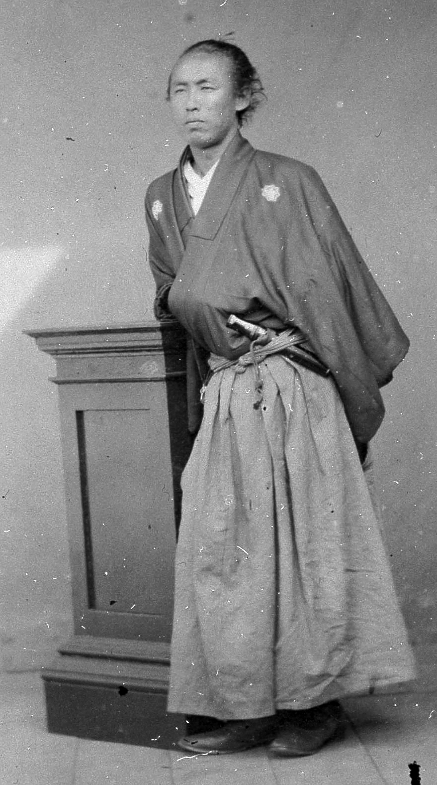
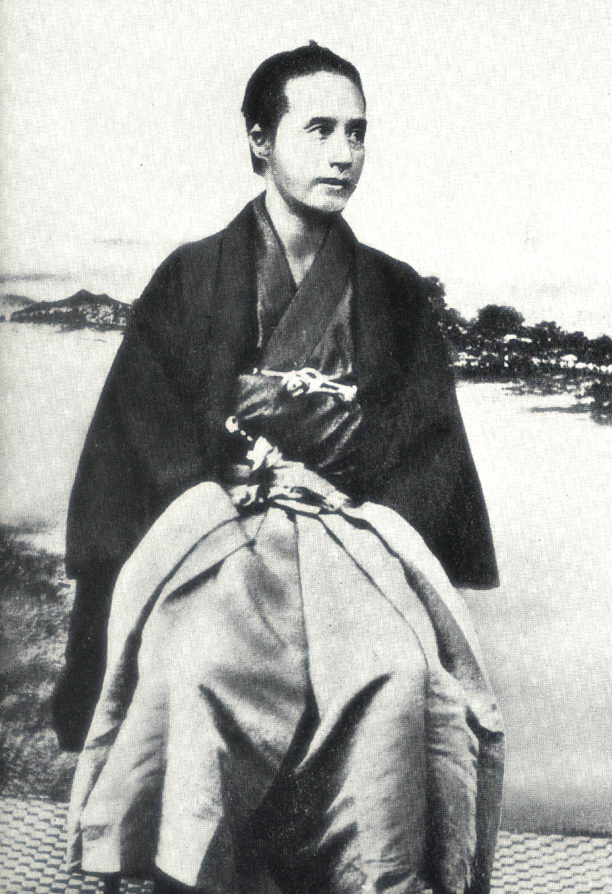

| 原书名   | 坂本龍馬と明治維新                                           |
| -------- | ------------------------------------------------------------ |
| 其它译名 | [中] 坂本龙马与明治维新／[英] *Sakamoto Ryoma and the Meiji Restoration* |
| 作者     | [美]                                                         |
| 类型     | 历史                                                         |
| 发表时间 |                                                              |
| 阅读时间 | 第一次：2024 年 1 月                                         |
|          |                                                              |

# 导读   一个维新的交易员

## 一

导读看着更像是闲聊，谈到了对坂本龙马的生平概述、不同时代下日本人对坂本龙马的态度，以及坂本龙马主题的小说家、历史学家。

### * 原文赏析

>   这位士佐志士身着松松垮垮的和服，双手背后，一头乱发向后拢去，一把短刀斜插在腰间，昂首远方。他眉毛粗重，双眼眯成一条狭长缝隙，紧闭的嘴角向下撇去，显得踌躇满志又漫不经心。这神情也是志士们对自己的普遍期许——心系日本之命运，却把个人安危置之度外。

看到这几句描述，脑海中慢慢地就回忆起了这张照片。

 坂本龙马经典肖像

之前有搜过「坂本龙马」这样的词条，看到照片第一眼就印象深刻，外貌特征极为独特。同时也发给了我母亲看，她是语文教师，对这些好的文字描述还是比较敏感的。

>   这也是日本的另一个有趣之处，它的历史人物既有神一般的地位，备受崇敬，又有一种奇特的亲切感。他们被制成玩偶、进入漫画、拍成偶像剧、进入商业广告，像是你身边的朋友。各地都会组成协会，他们研究、讨论这些人物，寄托自己的个人期望，寻找社群的慰藉。

这段话不禁令我联想到二次元，不也差不多是这种情形么？

> 这个形象是事实与传说的混合体，每个时代都按自己的方式塑造他。第一部关于坂本龙马的小说，出版于 1883 年。那正是自由民权高涨之时，龙马被塑造成一个民主与宪政的先行者。土佐藩虽已变成了高知县，但他额昔日伙伴板垣退助成为这场运动的中坚力量；20 世纪 20 年代，众多小说将他塑造成一个和平主义者、一个为自由而战的人，这响应了大正民主浪潮；20 世纪 40 年代初，他又摇身变成了帝国海军的先驱、狂热的爱国者。

正所谓“与时俱进”啊。

## 二

值得一提的是，坂本龙马与曾为「兰学家」的[胜海舟](https://zh.wikipedia.org/wiki/%E8%83%9C%E6%B5%B7%E8%88%9F)的会面是日本历史上「最浪漫的传说」之一，预谋的刺杀变成了促膝长谈。

 胜海舟全身像

而这位胜海舟先生后来成为了幕府的海军负责人、使江户和平开城、并且还担任明治海军职位等，看样子确实是一位传奇政治人物。

### * 原文赏析

> 1835 年，他出生在土佐藩一个富裕的乡土之家，当时日本似乎处于一种永恒的稳定之中。

玩原神玩的。

# 写在新版的前面

# 序言

# 第一章   龙马的日本

## 德川时代的背景

作者认为先让读者了解一下背景会更有帮助，于是出现了大量篇幅系统地介绍德川时代的背景。读到本节才意识到本书的专业性还是比较强的，至少对于我这样的非历史专业人士读起来怕是确实有些吃力，一大堆陌生的名词接踵而至。那能有什么办法呢，为了能读明白，还是一点一点地查。

### * 名词解析

- 「[**征夷大将军**](https://zh.wikipedia.org/wiki/%E5%BE%81%E5%A4%B7%E5%A4%A7%E5%B0%87%E8%BB%8D)」（日语：征夷大将軍／せいいたいしょうぐん *^Seii^ ^Taishōgun^* [*****](https://ja.wikipedia.org/wiki/征夷大将軍)**/**[**?**](https://zh.wikipedia.org/wiki/Help:日語)）可以追溯到 12 世纪末，小时候看《世界五千年》时候翻到的[源赖朝](https://zh.wikipedia.org/wiki/%E6%BA%90%E8%B5%96%E6%9C%9D)其实正是首任征夷大将军，同时创立了 幕府。这里的「夷」字和中国古代「蛮夷」说法类似，就是指「边境地带的敌人」，是要被鄙视或征服的。征夷大将军“征”的就是「虾夷」，是日本古朝廷对分布于本州、北海道的日本东北部族群的蔑称。征夷大将军的[衙门](https://zh.wikipedia.org/wiki/衙門)称为[幕府](https://zh.wikipedia.org/wiki/幕府_(日本))，故中文俗称征夷大将军为「幕府将军」，也常简称其为「将军」。

- 「[**幕府**](https://zh.wikipedia.org/wiki/%E5%B9%95%E5%BA%9C_(%E6%97%A5%E6%9C%AC))」可以理解为正是日本历史上凌驾于天皇之上的实际掌权机构。详情可查阅维基百科。

    > **幕府**（日语：幕府／ばくふ *^bakufu^* [*****](https://ja.wikipedia.org/wiki/幕府)**/**[**?**](https://zh.wikipedia.org/wiki/Help:日語)），是指[日本历史](https://zh.wikipedia.org/wiki/日本歷史)上由[征夷大将军](https://zh.wikipedia.org/wiki/征夷大將軍)领导与统治的[武家政权](https://zh.wikipedia.org/wiki/武家政權)，为[日本](https://zh.wikipedia.org/wiki/日本)特有国情下所产生近似“[尊王攘夷](https://zh.wikipedia.org/wiki/尊王攘夷)”的政治体制，从 1185 年[源平合战](https://zh.wikipedia.org/wiki/源平合戰)结束时开始，至 1867 年[明治维新](https://zh.wikipedia.org/wiki/明治維新)时结束，历经[镰仓幕府](https://zh.wikipedia.org/wiki/鎌倉幕府)、[室町幕府](https://zh.wikipedia.org/wiki/室町幕府)、[鞆幕府](https://zh.wikipedia.org/w/index.php?title=鞆幕府&action=edit&redlink=1)、[江户幕府](https://zh.wikipedia.org/wiki/江戶幕府)的四个幕府时期，其中鞆幕府是室町幕府消亡后的[残存势力](https://zh.wikipedia.org/wiki/流亡政府)，期间实际上统治国家的政权是[织田政权](https://zh.wikipedia.org/wiki/織田政權)和[丰臣政权](https://zh.wikipedia.org/wiki/豐臣政權)，因此事实上日本经历的是三个幕府时期，由[河内源氏](https://zh.wikipedia.org/wiki/河內源氏)、[北条氏](https://zh.wikipedia.org/wiki/北條氏)、[足利氏](https://zh.wikipedia.org/wiki/足利氏)、[德川氏](https://zh.wikipedia.org/wiki/德川氏)先后相继统治时间总长 682 年。
    >
    > [日本](https://zh.wikipedia.org/wiki/日本)有着长期[武官](https://zh.wikipedia.org/wiki/武家)执政的历史，武家强人以统治[天下](https://zh.wikipedia.org/wiki/天下)为志向，开设最高指挥机构“[幕府](https://zh.wikipedia.org/wiki/幕府)”，类似于现代所称的[军政府](https://zh.wikipedia.org/wiki/軍政府)。征夷大将军必须由[天皇](https://zh.wikipedia.org/wiki/天皇)任命，表面上是天皇的臣子，但大部分均为[世袭](https://zh.wikipedia.org/wiki/世襲)，且从凌驾正规的[朝廷](https://zh.wikipedia.org/wiki/朝廷)体系后来慢慢变成正规的朝廷体系之内的一部分（[公家](https://zh.wikipedia.org/wiki/公家)）；由于当时日本实施[封建](https://zh.wikipedia.org/wiki/封建)统治，征夷大将军并不会直接掌控全国，而是会分封[采邑](https://zh.wikipedia.org/wiki/采邑)给诸有力的[武士](https://zh.wikipedia.org/wiki/武士_(日本))，征夷大将军的地位则等同为天下之[共主](https://zh.wikipedia.org/wiki/共主)，事实上是以“[挟天子以令诸侯](https://zh.wikipedia.org/wiki/挟天子以令诸侯)”的方式治国。另一方面，由于天皇在当时的地位相当神圣，即使担任征夷大将军的[氏族](https://zh.wikipedia.org/wiki/氏族)有所更迭，也没有外人敢直接[篡夺](https://zh.wikipedia.org/wiki/篡位)天皇大位。日本这种特殊的政治体制，迥异于同时代世界上的其他国家。

- **大名**（日语：大名／だいみょう *^Daimyō^*）是[日本](https://zh.wikipedia.org/wiki/日本)[封建时代](https://zh.wikipedia.org/w/index.php?title=封建制度_(日本)&action=edit&redlink=1)对一个较大地域[领主](https://zh.wikipedia.org/wiki/領主)的称呼，由**名主**一词转变而来。

- **旗本**〈日语：旗本／はたもと *^hatamoto^*〉是中世纪到近代的[日本武士](https://zh.wikipedia.org/wiki/日本武士)的一种身分。一般是指在[江户时代](https://zh.wikipedia.org/wiki/江戶時代)[石高](https://zh.wikipedia.org/wiki/石高)未满一万石，但有资格在将军出场的仪式上出现，[御目见](https://zh.wikipedia.org/wiki/御目见)以上的[德川将军家](https://zh.wikipedia.org/wiki/德川將軍家)的直属家臣团的统称。即使薪酬只有二百石的家臣，[御目见](https://zh.wikipedia.org/wiki/御目见)以上都视为旗本，否则称为[御家人](https://zh.wikipedia.org/wiki/御家人)。旗本所统治的领地称作[知行所](https://zh.wikipedia.org/w/index.php?title=知行所&action=edit&redlink=1)。

    在日本的[战国时代](https://zh.wikipedia.org/wiki/战国时代_(日本))，旗本一词最初指的是在战场上守护主君军旗的武士团。

大量的篇幅其实上无非就是在讲历史上常见的一系列老生常谈的问题：权力高层之间的斗争、中央与地方的关系、当权者与人民的关系
