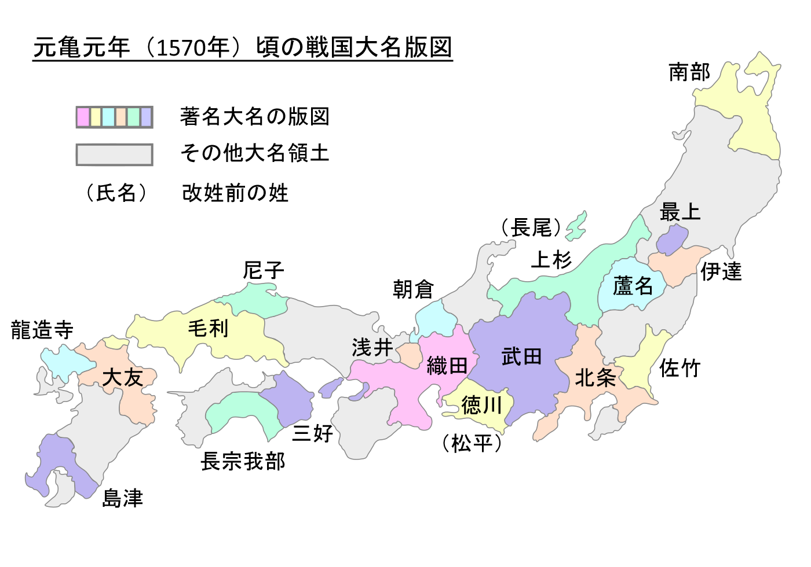

| 原书名   | 日本時代史. 第8巻 安土桃山時代史                             |
| -------- | ------------------------------------------------------------ |
| 其它译名 | [中] 早稻田大学日本史（卷八）：安土桃山时代／[英] *Sakamoto Ryoma and the Meiji Restoration* |
| 作者     | [日] 渡辺世祐                                                |
| 类型     | 历史                                                         |
| 发表时间 | 1926 年 12 月                                                |
| 阅读时间 | 第一次：2024 年 5 月                                         |
|          |                                                              |

 元亀元年頃の戦国大名版図（推定） （图源：https://ja.wikipedia.org/wiki/%E6%88%A6%E5%9B%BD%E5%A4%A7%E5%90%8D）

# 序言

开篇便讲安土、桃山这两个时代是「两千五百余年日本国史」最耐人寻味的时代。后面紧接着就解释道：安土桃山最富于变化，日本其他历史时期难以见到。

> #### 【精彩片段】
>
> 在民间不得志的人、门第低的人开始崭露头角，有为的人不可能永远在社会下层安分守己，都抓住这一良机一举成名。乱世出英雄，天下豪杰揭竿而起，获得一块地盘以后，他们不断扩张势力，于是出现了群雄割据的局面，天下一旦大乱，便很难平静下来。而能够力压群雄统一天下者，就是世间少有的英杰，是能够快刀斩乱麻的大人物。

> #### 【概念解析】
>
> **室町时代**（日语：むろまちじだい，1336 年—1573 年），是[日本历史](https://zh.wikipedia.org/wiki/日本史)中世时代的一个划分，名称源自于[幕府](https://zh.wikipedia.org/wiki/幕府_(日本))设在[京都](https://zh.wikipedia.org/wiki/京都)的[室町](https://zh.wikipedia.org/wiki/室町)。前后共经历 16 代将军，历 237 年。上承[镰仓时代](https://zh.wikipedia.org/wiki/鎌倉時代)，下启[安土桃山时代](https://zh.wikipedia.org/wiki/安土桃山时代)。
>
> **应仁之乱**（1467 年─1477 年，应仁元年—文明 9 年）发生于日本室町幕府第八代将军足利义政在任时的一次内乱。主要是幕府三管领中的细川胜元与四职中的山名持丰（山名宗全）等守护大名的争斗。其范围除九州等部分地方以外，战火遍及其他日本国土，动乱使日本进入将近一个世纪的战国时代。

# 第一编   安土时代

织田信长能够在战国时代建功立业，分析起来还是离不开几个很关键的点：幸运、能力强、地理位置优越、周边对手大多都不强。

## 第 1 章   织田氏勤王

### 一、皇室的情况

室町末期的日本皇室，看起来有些 “可怜”。收税难、皇宫破败，甚至搞到照明的蜡烛都是难题。

> #### 【精彩片段】
>
> 伊势神宫漏雨需要修缮，也要靠领主捐款。
>
> 
 伊勢神宮　内宮 （图源：https://lets-see-japan.com/areas/kansai/ise-jingu/）

# 第二编   桃山时代

