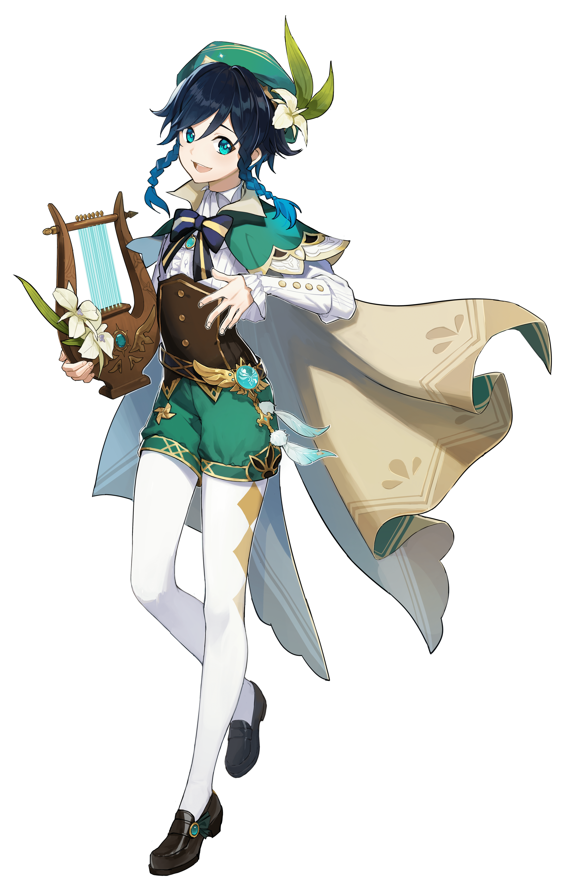

出自萌娘百科【[温迪](https://zh.moegirl.org.cn/%E6%B8%A9%E8%BF%AA)】词条

# 基本资料

| 本名     | 中：温迪／巴巴托斯 英：Venti／Barbatos 日：ウェンティ／バルバトス 韩：벤티／바르바토스 |
| -------- | ------------------------------------------------------------ |
| 别号     |                                                              |
| 出生年代 | 约 2600 年前                                                 |
| 生日     | 6 月 16 日                                                   |
|          |                                                              |
| 个人状态 | 失去神之心，以「吟游诗人」身份摸鱼                           |
| 挚友     | 无名的少年                                                   |
| 战友     | 无名的少年、无名的骑士（莱艮芬德）、无名的猎手（阿莫斯）     |
| 敌人     | [迭卡拉庇安](https://zh.moegirl.org.cn/迭卡拉庇安)、[杜林](https://zh.moegirl.org.cn/杜林(原神)) |
| 老友     | [尘世七执政](https://zh.moegirl.org.cn/%E5%B0%98%E4%B8%96%E4%B8%83%E6%89%A7%E6%94%BF) |

# 经历

## 约 2600 年前

==温迪本是蒙德千风之中的一只[**元素精灵**](https://zh.moegirl.org.cn/元素精灵)。==在旧蒙德，温迪结识了一位**少年**。少年带领民众反抗统治他们的暴君[迭卡拉庇安](https://zh.moegirl.org.cn/迭卡拉庇安)。

最后，暴君陨落，少年战死。==温迪获得了力量成为了新神，**魔神巴巴托斯**。==一直与迭卡拉庇安相争的魔神[安德留斯](https://zh.moegirl.org.cn/安德留斯)也因为自己的特性选择离开。**[魔神战争](https://zh.moegirl.org.cn/%E6%8F%90%E7%93%A6%E7%89%B9%E5%A4%A7%E9%99%86#%E9%AD%94%E7%A5%9E%E6%88%98%E4%BA%89)**结束，魔神巴巴托斯成为[尘世七执政](https://zh.moegirl.org.cn/尘世七执政)之一的风之神。

温迪为了纪念友人，得到神力后第一件事就是以==少年的模样重塑自身的形体==，弹起了友人最喜欢的竖琴，从此==以这个少年的形体行走于尘世。==

此后巴巴托斯——温迪将自己的智慧传授于蒙德人，修改现今蒙德地区的地形，从旧蒙德（今风龙废墟）迁徙过来定居，设立诸多节日与庆典。随后，==温迪因不愿成为新的暴君而离开蒙德，让蒙德成为自治的自由之邦。==

魔神战争结束后，风神曾到邻国璃月请岩神品尝蒲公英酒。此后，最初的七神多次在璃月相聚[^岩神感慨]。

## 1000 年前

新蒙德建成后约 1600 年，以**劳伦斯**一族为首的贵族掌控了蒙德，温迪响应追随者的祈祷而再次苏醒。

作为**吟游诗人**行走于蒙德城，发现城里气氛异常压抑。羽球节当天给苹果摊贩演奏了一曲很久没有被演奏过的《风之歌》（暗示劳伦斯等人对风神的信仰早已丢失），后被这位摊贩警告「千万不要碰那个羽球」。

在庆典上打听到了贵族的荒诞残暴的行径，上前夺走了羽球戏耍贵族，被士兵追杀，逃跑途中遇到了[温妮莎](https://zh.moegirl.org.cn/温妮莎)，得到她的掩护。

温妮莎因此触怒贵族而被捕。温迪当晚便得到了牢房钥匙，进入牢房与温妮莎交谈。内容主要如下：

-   温妮莎是穆纳塔一族的后人，这个族很早就离开了**火之神**的领地开始流离失所，后卖身给蒙德贵族们沦为角斗士；
-   温迪向其展示了自己的竖琴「天空之琴（Holy Lyre der Himmel）」[^天空之琴疑似吃书的环节]。
-   温迪请求将温妮莎写入诗歌中，被婉拒；
-   据温迪的回忆，天空岛似乎有什么很不好的事物存在；
-   温迪想带着温妮莎和她的族人一起逃离蒙德。但是温妮莎表示自己的族人已经忘记了「自由」的含义，无论如何都要参加第二天的决斗来唤醒族人们的抗争与自由意识，否则只会被拷上另一种力量支配的枷锁。温迪离开。

第二天贵族们不要脸地把温妮莎一族全部赶到城外，要求其打败魔龙乌撒，还放箭射杀撤退的人。这时温迪突然出现，引导风之力使温妮莎砍中了魔龙，并且使用神力勒令魔龙退却。这时温迪请求将温妮莎写入诗歌，得到同意，表示这会是以温妮莎一族为主角的新篇。最后，要求劳伦斯遵守规则，把蒙德的控制权交出来。

此外还通过伪造摩拉克斯的签名制造了《背风的密约》使得大量士兵反叛，和温妮莎一起掀翻了贵族统治。

风神巴巴托斯的眷属组成了[四风守护](https://zh.moegirl.org.cn/四风守护)。风神再次离开。

## 500 年前

包括风神在内的众神一同降临，覆灭了坎瑞亚。

坎瑞亚灾厄扩散到整个提瓦特。魔龙**杜林**与漆黑的魔物浪潮一起袭击蒙德，西风骑士团奋力拼杀。

风神与眷属特瓦林一同迎击杜林，最终将杜林斩落雪山。风神与==被魔龙毒血腐蚀的**风龙**==各自陷入了沉睡。

## 序章 第一幕 「捕风的异乡人」

在蒙德的低语森林内，温迪成功吸引了被深渊教团诅咒的风魔龙[特瓦林](https://zh.moegirl.org.cn/特瓦林)，想要帮助特瓦林驱除诅咒，==但由于风元素的共鸣，暴露了躲在附近树后的旅行者与派蒙，发现外人在场的特瓦林当场发狂。温迪无奈撤离。==

## 序章 第二幕 「为了没有眼泪的明天」

温迪随后在蒙德的骑士团总部前走过，前往教堂广场为观众们演唱特瓦林的故事。旅行者与派蒙发现他就是与巨龙对话的人，连忙追上。在一番互相介绍后，温迪发现旅行者拥有净化龙的泪滴的能力，随后在风起地的大树下向旅行者与派蒙讲述了特瓦林落入到现在这个地步的原因。

温迪想出了一个计划，并与旅行者派蒙一起前往蒙德大教堂寻找**天空之琴**。==温迪向教堂的修女称自己就是巴巴托斯，但修女并不相信，于是旅行者便潜入教堂偷取天空之琴，但在即将得到之时被愚人众抢走。==旅行者被通缉，跟随温迪躲入酒馆**天使的馈赠**。

酒馆的老板**迪卢克**察觉到了异常，在打发了骑士团的人后向众人询问情况，温迪则向迪卢克重新演奏了特瓦林的故事，并说明了真实意图，随后迪卢克联系到了骑士团代理团长琴，并寻找到了关于天空之琴的情报。众人蒙面前往愚人众的藏身地成功拿走天空之琴[^蒙面旅行者和迪卢克]，并在旅行者的努力下成功修复了天空之琴。

温迪带领旅行者、琴、迪卢克一行人前往**摘星崖**使用天空之琴召唤特瓦林，但特瓦林已被**深渊法师**控制地彻底失去理智。==众人也通过特瓦林之口得知了温迪的真实身份为风神「巴巴托斯」==

## 序章 第三幕 「巨龙与自由之歌」

温迪带领众人前往风龙废墟寻找特瓦林，在经历重重困难后终于进入了风龙废墟的深处，并经过一番恶战清除了特瓦林背后的**深渊凝血**。在平台倒塌后特瓦林接住了下落的众人，温迪也意识到让特瓦林继续履行守护的职责对他而言也是一种自由。

一切结束后温迪与旅行者前往教堂向牧师**芭芭拉**归还天空之琴。==芭芭拉看到损坏的天空之琴后极为崩溃，并试图祈祷以获得巴巴托斯原谅。==一旁的温迪随即使用幻术「修复」了天空之琴后与旅行者逃出教堂，==但在教堂门口被愚人众执行官「**女士**」袭击，温迪的神之心被夺走，昏迷在地，==被芭芭拉勉强救回。温迪醒来后急忙前往让他安心的风起地治疗，在风起地，温迪向旅行者述说了关于这个大陆的许多事情，随后继续开始了他的吟游生涯。

[^岩神感慨]: 岩神：欲买桂花同载酒……只可惜故人，何日再见呢？
[^天空之琴疑似吃书的环节]:漫画中天空之琴的和游戏中大教堂里的那个长相似乎不太一样
[^蒙面旅行者和迪卢克]:在该秘境中旅行者和迪卢克的模型上会显示一个面具