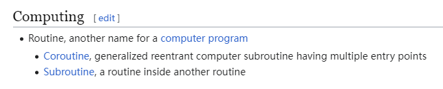

| 原书名   | *Core Java, Volume I: Fundamentals, Twelfth Edition* |
| -------- | ---------------------------------------------------- |
| 其它译名 | [中] Java 核心技术：卷 I 开发基础                    |
| 作者     | [美] Cay S. Horstmann                                |
| 类型     | IT 技术                                              |
| 发表时间 | 2021 年 10 月                                        |
| 阅读时间 | 第一次：2022 年 8 月                                 |
|          | 第二次：2023 年 10 月下旬                            |

# 第 1 章   Java 程序设计概述

## 1.1   Java 程序设计平台

### 1.2.3   分布式

>   **例程（[routine](https://en.wikipedia.org/wiki/Routine)）**：维基百科上对「例程」这个概念的解释很简单，就是「计算机程序」的又名。
>
>   

### 1.2.4   健壮性

>   **动态（运行时）检测（dynamic (runtime) checking）**：
>
>   **指针模型**：
>
>   **重写内存（overwriting memory）**：

# 第 7 章   异常、断言和日志

# 第 8 章   泛型程序设计

