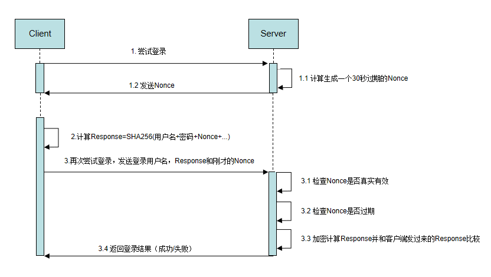

https://developer.kingdee.com/article/311461951647625216?productLineId=29&isKnowledge=2&lang=zh-CN


在上一篇文章《[苍穹 OpenAPI 入门篇之 AccessToken 认证](https://vip.kingdee.com/article/311458805903550720)》中，我们介绍了金蝶云苍穹三种认证方式中的 AccessToken 认证，本期小编为大家介绍另一种安全便捷的登录认证方式：**摘要认证**。

---


## 1   应用场景


第三方系统调用金蝶云苍穹 API 服务时，需先通过身份认证。


## 2   解决方案


金蝶云苍穹支持通过「摘要认证」进行身份认证。


### 2.1   摘要认证简介

摘要认证通过 **SHA-256** 加密算法生成摘要，保障客户端与服务端通信的内容不被第三方篡改，提高破解和报文重放攻击的难度，是一种**安全性更高**的认证方式。


### 2.2   摘要认证特点

摘要认证是基于 HTTP 基本认证的**改进**版本，其主要特点在于：当我们访问某个 URL 时，在请求中使用摘要来代替密码的传输，并且采用 MD5、SHA 之类的「不可逆哈希算法」对密码加密，增强了敏感数据在传递过程中的安全性，在一定程度上防止信息被篡改，保障通信的安全。


### 2.3   摘要认证过程原理

客户端第一次请求时，通过服务端生成**随机数**，并将该随机数放在响应头中发送回客户端。然后，客户端根据「随机数」、「时间戳」和其他用户信息，通过指定的加密算法生成「摘要」。

后续客户端在调用请求时，将摘要放在请求头中再次发送给服务器。服务器获取到摘要后，根据请求信息从数据库取出客户端密码进行相同的计算后，与得出的摘要进行对比，匹配则身份验证通过，可以进行服务调用。

具体过程原理如下图所示：




## 3   功能实现


金蝶云苍穹的摘要认证流程具体如下：

### Step1   注册第三方应用

在金蝶云苍穹开放平台录入第三方应用的基本信息，路径为：【开发服务云】→【开放平台】→【第三方应用】。点击**摘要加密认证密钥**的 “刷新” 按钮，自动生成摘要加密认证 key。

### Step2   服务调用

金蝶云苍穹可以通过 Java 工具类指定默认算法（SHA-256）直接生成摘要：

- 对于 GET 方式提交的 API 内容，所有的验证内容均放置在 URL 的参数中；
- 对于 POST 方式提交的 API 内容，所有的验证内容放置在请求体中。

注：摘要计算公式为：HMACSHA256（query 的拼接参数／请求体内容 + timestamp + signatureNonce，key）。


#### 1）GET API 实例


请求示例：

```
https://feature.kingdee.com:2024/baseline_a/kapi/sys/isc_demo_basedata_1/query?select=name,number&filter=name%20eq%20123asd&appId=TEST%C3%97tamp=2021-08-18%2014:19:08&signatureNonce=iksiertoidkwek;oitdwudysletwsuej&signature=32beeebfc277817a80b01d5787242c51ca5295f5edcf2eb9371ff367f8b487a5%C2%B6meters=select&user=17299999999&usertype=Mobile&accountId=1173910536060928000
```

请求结果：

```json
{
    "success": "true",
    "data": {
        "count": 1,
        "header": [
            {
                "name": "name",
                "caption": "名称",
                "type": "String"
            },
            {
                "name": "number",
                "caption": "编码",
                "type": "String"
            }
        ],
        "rows": [
            [
                "123asd",
                "123asd"
            ]
        ]
    }
}
```

HTTP query 查询参数说明如下：

| 传入参数       | 字段类型 | 是否必输 | 字段说明                                                     |
| -------------- | -------- | -------- | ------------------------------------------------------------ |
| select         | string   | 是       | 定义查询类服务的返回参数，如 “id”、“name”、“number” 等       |
| filter         | string   | 否       | 过滤参数、可以设置查询条件如 “filter=name eq 123asd”         |
| appId          | string   | 是       | 第三方 appId                                                 |
| timestamp      | string   | 是       | 当前时间，和服务器时间相差 10 分钟就为无效请求。目前格式为 yyyy-HH-dd HH:mm:ss，以后为时间戳格式 |
| signatureNonce | string   | 是       | 访问随机数，最好 32 位 UUID。如果随机数已经访问过，则再次访问无效 |
| signature      | string   | 是       | 用 SHA-256 算法和摘要加密认证密钥 key 对 query 的拼接参数（如：testA=tt&testB=tt2 + timestamp + signatureNonce）进行摘要后的结果。公式：HMACSHA256（query 的拼接参数 + timestamp + signatureNonce，key） |
| parameters     | string   | 是       | 参与摘要的参数列表，多个参数用 “,” 隔开                      |
| user           | string   | 是       | 用户手机号                                                   |
| usertype       | string   | 否       | 用户类型。Mobile 标识为手机，默认为手机；Email：标识为 email；UserName 标识为用户名 |

*注：如果没有参数，也需要加一个默认参数“test=tt”来完成数据的认证。*


2）**POST API** 实例


请求示例：

```
http://localhost:8080/ierp/kapi/sys/pm_purorderbill/save
```


```json
// 请求Header参数：
appId=test
signature=32beeebfc277817a80b01d5787242c51ca5295f5edcf2eb9371ff367f8b487a5
timestamp=2020-08-19 15:31:59
signatureNonce=iksiertoidkwek;oitdwudysletwsues
user=130****2580
usertype= Mobile
accountId=1173910536060928000   
// 请求BODY参数：
{
    "data": {
        "number": "cugQ",
        "name": "cugQ",
        "alias_name": "cugQ"
    }
}
// 请求结果：
{
    "data": {
        "success": true,
        "needSign": false,
        "needWfAssignPersons": false,
        "cancelWriteLog": true,
        "showMessage": true,
        "billCount": 1,
        "successPkIds": [
            1226640481962735616
        ],
        "billNos": {
            "1226640481962735616": "cugQ"
        },
        "validateResult": {
            "validateErrors": [],
            "success": true,
            "message": "",
            "errorPkIds": [],
            "errorDataIndexs": []
        },
        "runSecond": 0,
        "allErrorOrValidateInfo": [],
        "allErrorInfo": []
    },
    "success": true,
    "errorCode": "success",
    "message": null
}
```


| 传入参数       | 字段类型 | 是否必输 | 字段说明                                                     |
| -------------- | -------- | -------- | ------------------------------------------------------------ |
| appId          | string   | 是       | 第三方 appId                                                 |
| timestamp      | string   | 是       | 当前时间，和服务器时间相差 10 分钟就为无效请求。目前格式为 yyyy-HH-dd HH:mm:ss，以后为时间戳格式 |
| signatureNonce | string   | 是       | 访问随机数，最好 32 位 UUID。如果随机数已经访问过，则再次访问无效 |
| signature      | string   | 是       | 用 SHA-256 算法和摘要加密认证密钥 key 对 query 的拼接参数（如：testA=tt&testB=tt2 + timestamp + signatureNonce）进行摘要后的结果。公式：HMACSHA256（query 的拼接参数 + timestamp + signatureNonce，key） |
| user           | string   | 是       | 用户手机号                                                   |
| usertype       | string   | 否       | 用户类型。Mobile 标识为手机，默认为手机；Email：标识为 email；UserName 标识为用户名 |

如果内容为空，则在 body 中输入固定值，如：

```json
{
"testName": "test"
}
```


## 4   更多资讯


关于金蝶云苍穹开放平台 API 调用的更多知识，可点击下方链接查看：

[金蝶云苍穹开放平台 API 调用流程](https://vip.kingdee.com/article/213309216688450304)
